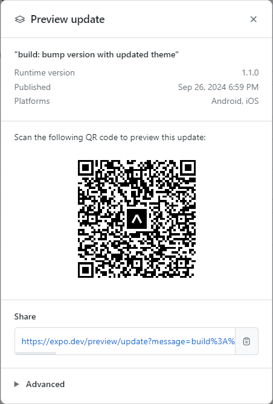

# to-do-list-app

## Prerequisites

1. **Install Node.js**: [Node.js](https://nodejs.org/).

2. **Install Expo Go (you do no need to register to use the app)**:
   - **iOS**: [Download Expo Go from the App Store](https://apps.apple.com/us/app/expo-go/id982107779).
   - **Android**: [Download Expo Go from Google Play](https://play.google.com/store/apps/details?id=host.exp.exponent).

## Installation

1. **Open the project folder** in Visual Studio Code.

2. **Open the terminal**:

   - In Visual Studio Code, click on **View** in the top menu.
   - Select **Terminal**
   - Or press `Ctrl + \` (Windows) or `Cmd + \` (Mac).

3. **Past the following command in the terminal and hit enter to install packages for app**:
   ```bash
   npm install
   ```

## Running the App

1. **Copy and paste following command in terminal and hit enter**:

   ```bash
   npx expo start
   ```

2. **How to view the app**:
   - Scan the QR code displayed in the terminal using the **Expo Go** app on your phone or by scanning it with your camera.

## Alternative Option to viewing and testing App

The app hosted live and can be viewed by downloading the **Expo Go** app from your app store and scanning the following QR code below:

[Scan this QR code to view the app](https://expo.dev/preview/update?message=build%3A%20bump%20version&updateRuntimeVersion=1.0.2&createdAt=2024-09-25T10%3A38%3A19.047Z&slug=exp&projectId=9e41ce3e-02a6-4251-854f-752906de74b3&group=ece40a9d-73f4-4285-bb07-96b33ba9f382).

### If link is not working can scan here


